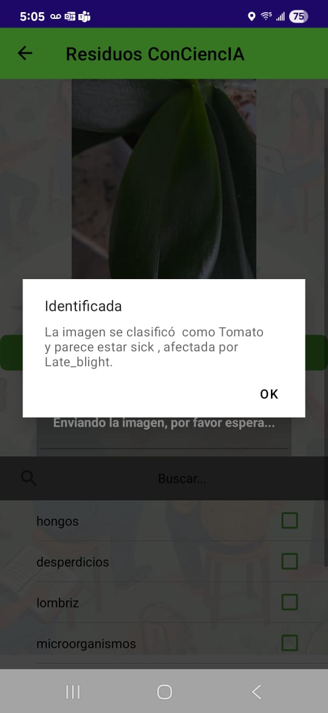

# IA al Servicio de las Comunidades: Clasificación Automática de Plantas en Huertas Urbanas

Este documento describe la solución, arquitectura y consideraciones clave para el despliegue del modelo de clasificación de plantas desarrollado como prueba de concepto para el proyecto de grado de la Maestría en Analítica para la Inteligencia de Negocios de la Pontificia Universidad Javeriana.

[Ver video de demostración App Residuos Conciencia](VideoApp1.mp4)

[Link a grupo de MS Teams (Unicamente para personal asosciado a la Pontificia Universidad Javeriana)](https://teams.microsoft.com/l/channel/19%3A2tnv9N6O0XxLudipE5QwlvCC7tPJx9QXXeQq__HQowk1%40thread.tacv2/General?groupId=5f191e35-a460-4bc0-96bf-c7032c5b1fe6&tenantId=daf7990e-8a3f-409c-9b76-2a5475098000)

[PLANTILLA_DE_INSUMOS_-COMUNICACIONES_CAOBA](PLANTILLA_DE_INSUMOS_-COMUNICACIONES_CAOBA.docx)

[Documento de Grado Final](https://github.com/MariaIzquierdoAparicio/Proyecto_de_grado/blob/main/docs/AMOM___MFIA_-_Proyecto_de_Grado_-_Tercera_entrega.pdf)


## Tabla de Contenidos

- [Descripción de la Solución](#descripción-de-la-solución)
- [Screenshots](#screenshots)
- [Arquitectura del modelo de Clasificación](#arquitectura-del-modelo-de-Clasificación)
- [Estructura del Proyecto](#estructura-del-proyecto)
- [Estructura de las carpetas de datos](#Estructura-de-las-carpetas-de-datos)
- [Requerimientos](#requerimientos)
- [Instalación](#instalación)
- [Ejemplo de Uso](#ejemplo-de-uso)
- [Autores](#autores)

---

## Descripción de la Solución

### Reto

Las comunidades urbanas de Bogotá enfrentan retos para identificar especies de plantas y su estado de salud en huertas urbanas debido a falta de conocimiento técnico y acceso a tecnología. Nuestro proyecto aborda este desafío mediante un modelo de clasificación automática de imágenes de plantas, que será integrado en la app "Residuos Conciencia" como herramienta de apoyo para los huerteros urbanos.

### Solución Propuesta

Se desarrolló un modelo de clasificación de imágenes de plantas basado en la arquitectura U-Net, capaz de identificar especie y condición (saludable o enferma). Este modelo podrá integrarse en la app "Residuos Conciencia", usada por la comunidad del proyecto social Terraza Verde.

### Impacto

Facilita el cuidado de cultivos, fomenta el aprendizaje comunitario y fortalece la adopción de tecnologías emergentes en agricultura urbana sostenible.

### Objetivos con el Negocio

#### General: 
Para el proyecto de IA al Servicio de las Comunidades: Modelo de Clasificación Automática de Plantas Cultivadas en Ecosistemas de Agricultura Urbana se ha definido el siguiente objetivo general:
Desarrollar una prueba de concepto de una solución basada en aprendizaje de máquina para la clasificación automática, en un periodo de 4 meses, para la clasificación automática de imágenes de plantas cultivadas en huertas urbanas del proyecto Terraza Verde, capaz de identificar la especie y su estado de salud con un desempeño mínimo de 70% de Accuracy

#### Específicos:      
   1. Preparar un conjunto de datos de al menos 5.000 imágenes de plantas (cubriendo al menos 5 especies y dos condiciones: saludable y enferma) correspondiente a especies que se encuentran en huertas urbanas, en un periodo máximo de 10 semanas, asegurando su calidad y diversidad para el entrenamiento de modelos.
   2. Evaluar al menos cuatro versiones de modelos de aprendizaje profundo midiendo su rendimiento con la métrica de accuracy y seleccionando el mejor modelo en términos de desempeño y capacidad de generalización.
   3. Entregar el modelo seleccionado, entrenado y documentado, para su incorporación posterior en la App "Residuos Conciencia" al concluir el presente trabajo.
   4. Evaluar el modelo desarrollado con los usuarios finales con el fin de garantizar su consistencia y coherencia con los requerimientos de las comunidades locales del programa Terraza Verde

### Entregables Esperados
   - Modelo final entrenado basado en U-Net (.h5).
   - Notebooks con código reproducible para entrenamiento y predicción.
   - Instructivo técnico de uso del modelo.
   - Documentación README con arquitectura, instalación y ejemplos de uso.

---

## Screenshots 

Los siguientes escreenshots pertencen a la aplicación movil "Residuos Conciencia" disponible en Android a traves de invitación. Esta App Móvil contiene el modelo de clasificación de imagenes desarrollado en la presente prueba de concepto. 

Los screenshots pertenecen de la fase de prueba del modelo integrado a la aplicación.




---

## Arquitectura del modelo de Clasificación

El modelo U-Net fue adaptado para tareas de clasificación multiclase a partir de imágenes RGB. La arquitectura incluye:

- Encoder con capas convolucionales y pooling
- Bottleneck para extracción profunda de características
- Decoder simplificado seguido de capa densa para clasificación

---

## Estructura del GitLab

Este proyecto está organizado en las siguientes carpetas, siguiendo buenas prácticas para ciencia e ingeniería de datos:

1. conf/
   Archivos de configuración del proyecto. Incluye el archivo de requerimientos en formato .txt, el cual indica las versiones y configuraciones específicas de python para correr correctamente los archivos aqui definidos.

2. dashboard/
   Esta carpeta contiene la visual con la cual se explica la definición del modelo de clasificación de imagenes de plantas a entregar para el deployment correspondiente.

3. data/
   Almacena los datos del proyecto, organizados por niveles de transformación:
     - raw/: Enlaces para acceso a los datos en bruto, tal como fueron obtenidos desde las fuentes abiertas utilizadas y sus respectivos códigos para su descarga. Continene tambien istruccione de cómo acceder a las fuentes abiertas. 
     - stage/: Metadatos limpiados y transformados parcialmente junto con códigos de organización y trasformación de los datos en bruto.
     - analytics/: Enlace a los datos finales listos para análisis y construccion de modelos, junto con los metadatos correspondientes y estadisticas de las imagenes con respecto a su distribución y calidad. Incluye diccionario utilizado de plantas, estados y enfermedades en inglés y español.

4. datalab/
   Espacio donde se guardan los diferentes archivos .ipynb utilizados para la experimentación de modelos de clasificación de imagenes. Aquí se documentan las exploraciones, pruebas de modelos y análisis de resultados.
    - printouts/: espacio donde se guardan las versiones en pdf de las diversas versiones de los modelos de clasificación generados.

5. deploy/
   Scripts y configuraciones para desplegar el proyecto en la app de "Resiudos Conciencia".

6. docs/
   Documentación del las diversas entregas y presentación de este proyecto. 
---

Esta estructura permite mantener un orden claro entre código, datos, configuraciones, documentación y resultados, facilitando la colaboración y el mantenimiento del proyecto.

## Estructura de las carpetas de datos

Teniendo en cuenta que tenemos mas de 50.000 imagenes, se disponen de enlaces a Google Drive para la consulta de las imagenes en sus diversos fotmatos (de acuerdo a lo especificado en los archivos de codigo .ipynb agregados a las carpetas de este GitLab). A Continuación se explica la organización de estas carpetas:

📦 **Datos Finales**  
┣━━ 📄 Todas las imágenes utilizadas en el modelado organizadas sin clasificación específica.

📦 **Datos Finales Enfermedad Balanceados**  
┣━━ 📄 Todas las imágenes utilizadas en el modelado que se encuentran balanceadas por tipo de planta, estado (Saludable vs Enferma) y enfermedad.

📦 **Datos Finales Estado Balanceados**  
┣━━ 📄 Todas las imágenes utilizadas en el modelado que se encuentran balanceadas por planta y estado (Saludable vs Enferma).

📦 **Datos Finales Plantas Balanceados**  
┣━━ 📄 Todas las imágenes utilizadas en el modelado que se encuentran balanceadas por tipo de planta.

📦 **Datos por Enfermedad**  
┣━━ 📁 Planta_A__Enfermedad_A  
┣━━ 📁 Planta_A__Enfermedad_B  
┣━━ 📁 Planta_B__Enfermedad_A  
┗━━ 📄 Imágenes clasificadas por tipo de enfermedad.

📦 **Datos por Enfermedad Balanceados**  
┣━━ 📁 Tomate__Enfermedad_A  
┣━━ 📁 Tomate__Enfermedad_B  
┣━━ 📁 Maíz__Enfermedad_A  
┣━━ 📁 Maíz__Enfermedad_B  
┗━━ 📄 Imágenes balanceadas clasificadas por tipo de enfermedad.

📦 **Datos por Estado**  
┣━━ 📁 Tomate__Saludable  
┣━━ 📁 Tomate__Enferma  
┣━━ 📁 Maíz__Saludable  
┣━━ 📁 Maíz__Enferma  
┗━━ 📄 Imágenes clasificadas por estado.

📦 **Datos por Estado Balanceados**  
┣━━ 📁 Tomate__Saludable  
┣━━ 📁 Tomate__Enferma  
┣━━ 📁 Maíz__Saludable  
┣━━ 📁 Maíz__Enferma  
┗━━ 📄 Imágenes balanceadas clasificadas por estado.

📦 **Datos por Planta**  
┣━━ 📁 Tomate  
┣━━ 📁 Maíz  
┣━━ 📁 Papa  
┗━━ 📄 Imágenes clasificadas por tipo de planta.

📦 **Datos por Planta Balanceados**  
┣━━ 📁 Tomate  
┣━━ 📁 Maíz  
┣━━ 📁 Papa  
┗━━ 📄 Imágenes balanceadas clasificadas por tipo de planta.

## Requerimientos

* Librerías Principales
   - Python 3.10+
   - TensorFlow 2.15+
   - NumPy
   - Pandas
   - Matplotlib
   - OpenCV

* Hardware
   - GPU (recomendado) con soporte CUDA
   - Memoria: mínimo 16 GB RAM

* Software
   - Anaconda
   - Jupyter Notebook
   - Entorno virtual (conda o venv)
   - Excel (uso de .csv y .xlxs)
   - Google Drive (almacenamiento de imágenes)

## Instalación

1. Crear entorno:

```
python -m venv env
source env/bin/activate
pip install -r requirements.txt
```
- [ ] archivo **requirements.txt** localizado en carpeta de deploy

2. Ejecutar notebooks ubicados en las carpeta datalab

## Ejemplo de uso:

```
import numpy as np
from tensorflow.keras.preprocessing.image import load_img, img_to_array

img_path = "ejemplo.jpg"
img = load_img(img_path, target_size=(128, 128))
x = img_to_array(img) / 255.0
x = np.expand_dims(x, axis=0)

# Obtener predicción
predicciones = modelo.predict(x)
y_pred = np.argmax(predicciones, axis=1)[0]
print(y_pred)

# Cargar el archivo .json con la lista de indice a la clase de prediccion
import json

# Cargar el diccionario desde el JSON
with open("index_to_class_modelo_16_Unet_PlantaEstado_Balanceado_Sin_Data_Aug_100perc.json", "r") as f:
    index_to_class = json.load(f)

# Asegurarse de que las claves sean enteros
index_to_class = {int(k): v for k, v in index_to_class.items()}

predicted_class_name = index_to_class[y_pred]
print(f"La clase predicha es: {predicted_class_name}")
```
## Autores

| Organización   | Nombre del Miembro | Correo electronico | 
|----------|-------------|-------------|
| Pontificia Universidad Javeriana - Bogotá | María Fernanda Izquierdo Aparicio: Economista - Estudiante Maestría Analítica para la Inteligencia de Negocios | mariaizquierdo@javeriana.edu.co |
| Pontificia Universidad Javeriana - Bogotá | Ana María Ochoa Muñoz: Ingeniera Civil - Estudiante Maestría Analítica para la Inteligencia de Negocios| an.ochoa@javeriana.edu.co |
| Pontificia Universidad Javeriana - Bogotá | Néstor Armando Nova, PhD - Director de Proyecto de Grado | novanestor@javeriana.edu.co |
| Pontificia Universidad Javeriana - Bogotá | Juan Erasmo Gómez, PhD - Director de Proyecto de Grado | je.gomezm@javeriana.edu.co |
